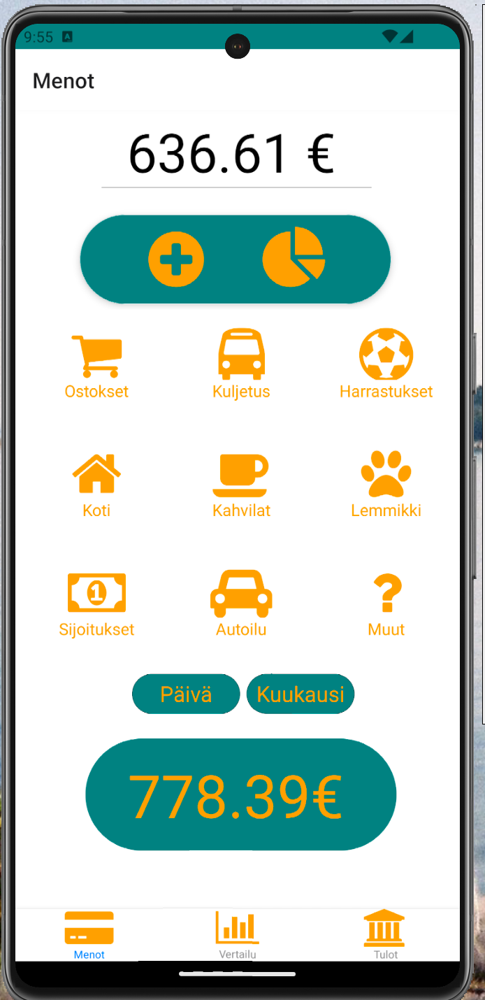
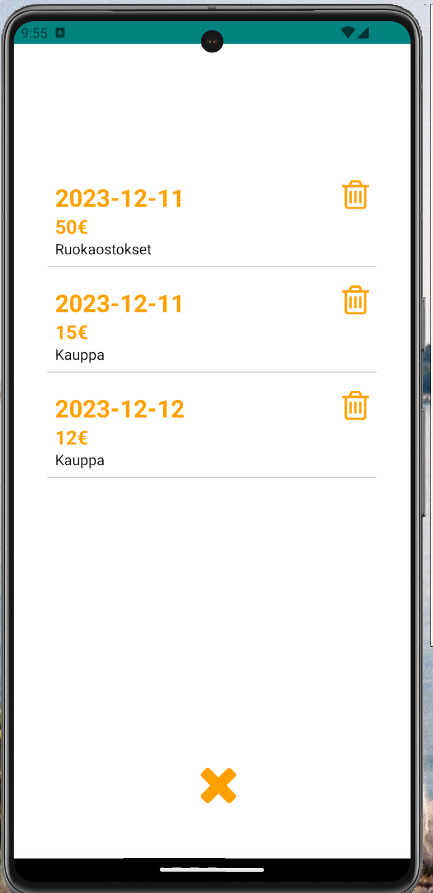
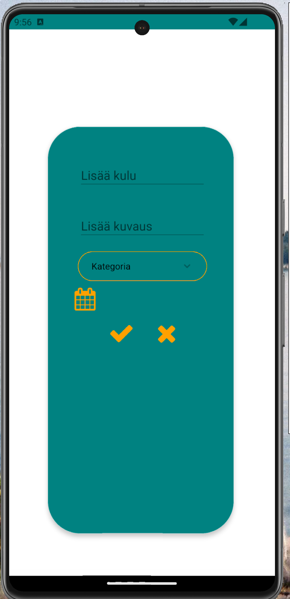
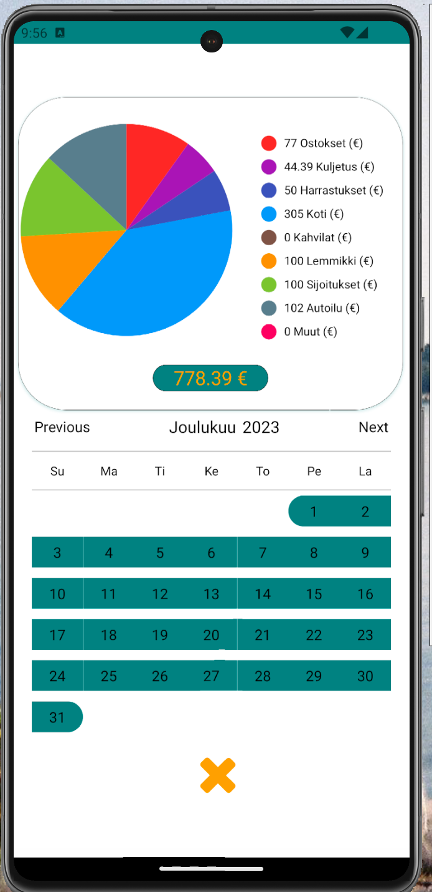
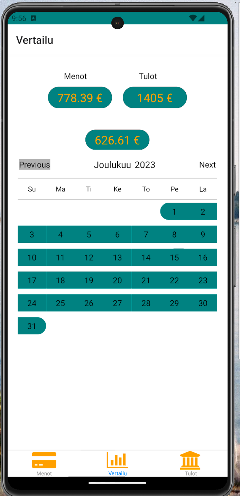

# Lopputyö (Mobiiliohjelmointi)
*Mobiiliohjelmointikurssin lopputyöni aihe on budjetointisovellus, missä käyttäjä voi seurata omia tuloja sekä menoja. Tulot ja menot on järjestetty kategorian, päivämäärän ja summan perusteella. Käyttäjä voi tarkastella omaa talouttaan eri aikaväleillä.* 

## Teknologiat ja kirjastot
- React Native
- Firebase
- react-native-chart-kit
- react-native-dropdown-select-list
- react-native-vector-icons
- react-native-calendar-picker
- Moment

## Käyttö
*Menot ja tulot sivuilla yläreunassa näkyy budjetti joka päivittyy aina kun summia lisätään tai poistetaan, budjettia painamalla sitä voi myös päivittää manuaalisesti. Eri kategorioita painamalla saa auki listan sen kategorian tapahtumista. Päivä ja kuukausi painikkeista voi vaihtaa alla näyettävää kokonaissummaa joko kuluvan päivän tai kuukauden perusteella.*

*Plus painikkeesta pääsee lisäämään uuden tapahtuman ja ympyrädiagrammi painikkeesta pääsee tarkastelemaan laajemmin tilastoja katgorioiden perusteella.*

*Vertailu sivulla voi verrata tuloja ja menoja hyvin yksinkertaisella tavalla.*

